

    
    <h1>Trader Charts</h1>
    <h3>Trader Charts is a tool for performing technical analysis with interactive charts. It allows users to visualize stock data or other asset data and apply technical indicators to analyze price trends.</h3>
    <h5>*One charting tool to rule them all*</h5>
     
    <!-- Frontend Badges -->
    

      <!-- Interactive Web Interface (Frontend) -->
      

        <b>Interactive Web Interface (Frontend)</b> 
        
        
        
        
        
        
        
        
        
      

      <!-- React Financial Charts - Exclusive version (Frontend) -->
      

        <b>React Financial Charts - Exclusive version (Frontend)</b> 
        
        
        
        
        
        
        
      

      <!-- Kairos AI -->
      

        <b>Kairos AI (Frontend)</b> 
        
        
        
        
        
        
        
        
        
      

      <!-- Backend -->
      
<b>API Multi-Microservices Architecture (Backend)</b> 
        
        
        
        
        
        
        
        
        
        
        
        
        
        
        
        
        
        
        
      

      <!-- Compute Services -->
      

        <b>LLM-powered AI & Data Automation Services (Compute Services)</b> 
        
        
        
        
        
        
        
        
        
        
        
        
      

    

> **Documentation updated through:** `v7.x`

---

🚀 **Want to contribute?**

We welcome collaborators who wish to contribute and help enhance this trading tool. Feel free to reach out to the maintainers to get involved.

---

## Trader Charts - Overview

This ecosystem brings together three specialized subprojects, each focusing on a key aspect of the trading workflow.
From automated data collection and processing, through scalable backend services, to interactive visual analytics for end users,
**_Trader Charts_** delivers a complete solution for technical analysis, market data visualization, and financial decision-making.

### 1️⃣ Interactive Web Interface & React Financial Charts Exclusive version & Kairos AI (Frontend)

- Provides interactive charts and tools for performing technical analysis and financial analysis.
- Built with React, MUI, Redux, and D3.js.
- Includes React Financial Charts (Exclusive version) — advanced charting components for financial data visualization.
- Includes financial analysis tools, bond analytics, expression building, and watchlist management.
- Provides authentication and user identity management through Auth0.
- Includes Kairos AI — a Svelte-based AI chat and data interface, enhancing user interactions and AI-powered features.
- [See Interactive Web Interface →](https://github.com/TraderCharts/trader-charts-frontend)

### 2️⃣ API Multi-Microservices Architecture (Backend)

- Handles API requests, processes data, and serves market and financial data to the Interactive Web Interface.
- Built with Node.js, Express, Babel, MongoDB, and PostgreSQL via Sequelize.
- Acts as the main microservice connecting the frontend with databases and external data services.
- Provides market data, financial analysis, bond metrics, and watchlist management services.
- [See API Multi-Microservices Architecture →](https://github.com/TraderCharts/trader-charts-backend)

### 3️⃣ LLM-powered AI & Data Automation Services (Compute Services)

- Gathers and processes stock or asset data from various providers.
- Cleans, structures, and stores data in MongoDB for use by the backend and Interactive Web Interface.
- Built with Python, Selenium, PyMongo, and Pandas.
- Automates market data collection and processing workflows.
- Supports incremental data collection and optimized processing of multiple assets.
- [See LLM-powered AI & Data Automation Services →](https://github.com/TraderCharts/trader-charts-compute-services)

Together, these components provide a full ecosystem for technical analysis and data visualization.

---

### 4️⃣ Orchestration & Deployment

Trader Charts can be run in both local development and production environments. The system leverages containerization and orchestration platforms to ensure scalability, consistency, and reliable deployment.

**Orchestration Platforms:**

- **Docker Compose** – Simplifies local development by allowing multiple microservices (API, compute services, frontend) to run together with a single command.
- **Kubernetes** – Provides production-grade orchestration, scaling, and management of microservices across multiple nodes.

> 💡 Tip: Step-by-step setup and deployment instructions are available in the internal guides.

**Learn more:**

- [Docker Compose Orchestration Guide](./../docker-compose/README_ORCHESTRATION_COMPOSE.md)
- [Kubernetes Orchestration Guide](./../k8s/README_ORCHESTRATION_K8S.md)

---

## Trading Charts demo

### Drawing Tools

Arrow, Rectangle, FreehandBrush, Linear Regression Channel and more:

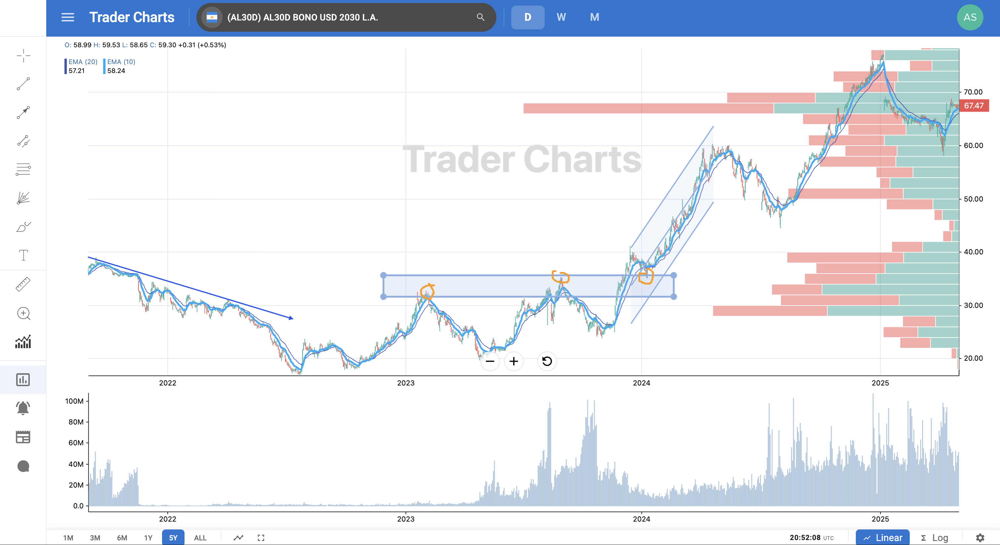

- Auth0 email login:

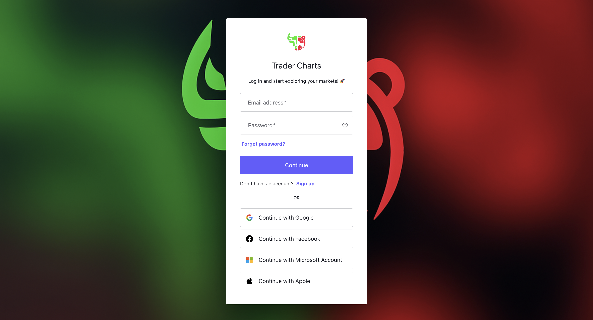

- Watchlists section:

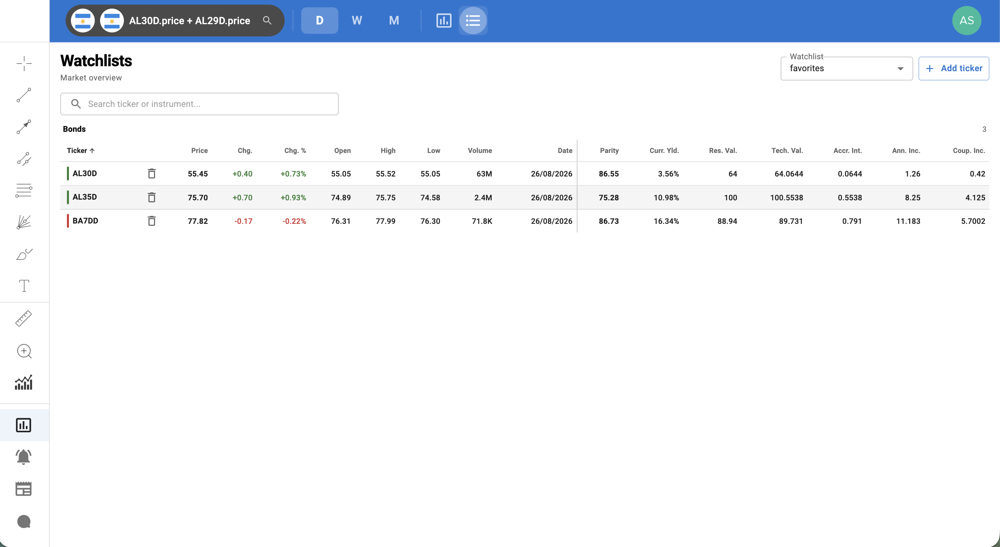

- Trending news and topic extraction with AI:

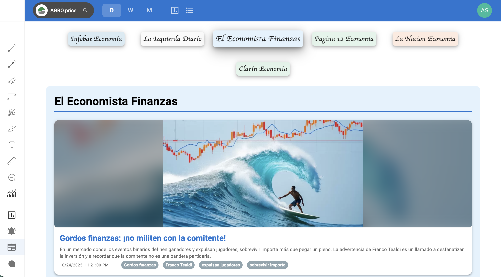

- Trending news and sentimental analysis with AI:

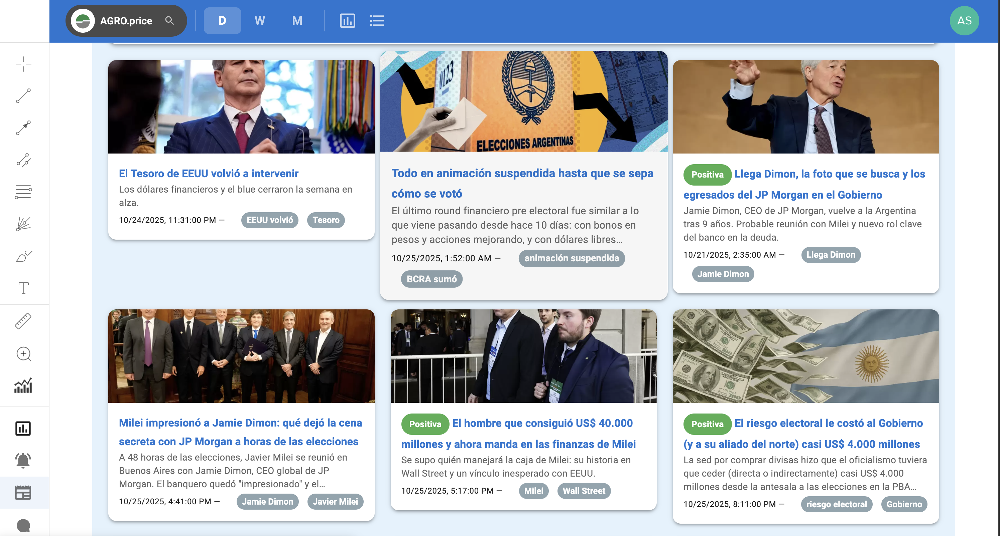

- Kairos AI Chat. Ask anything!

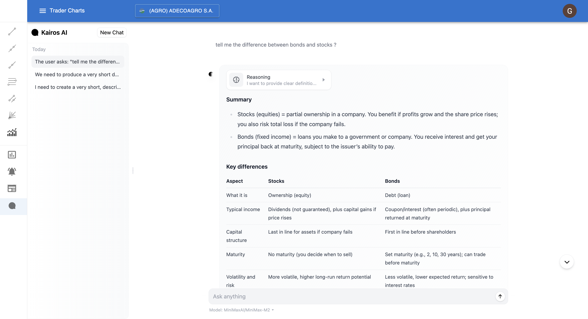

- Instrument Details

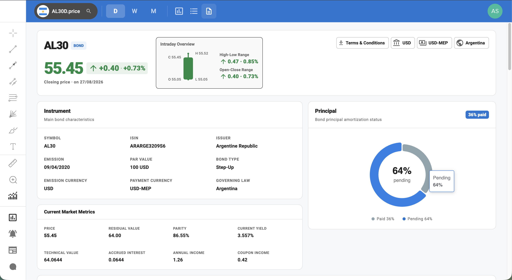

- Bonds Coupon Schedule

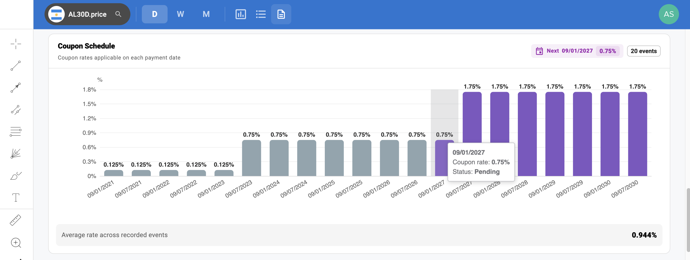

Tickers search & Expression Builder:

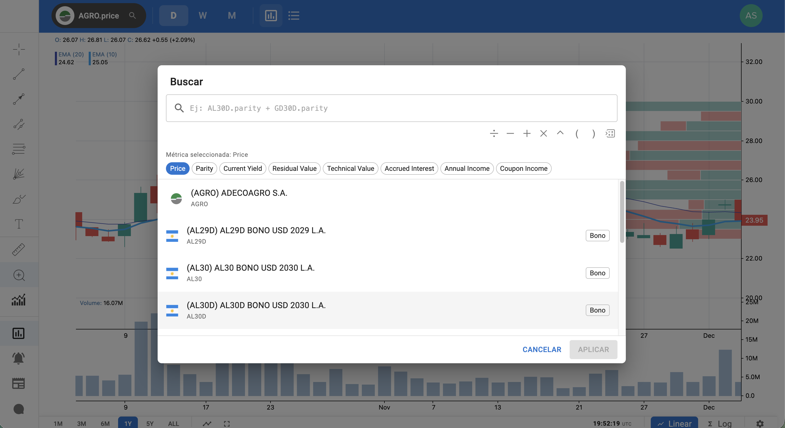

### Chart Controls

TimeRange selection (1M, 3M, 6M, 1Y, 5Y) and Linear/Log scale toggle:

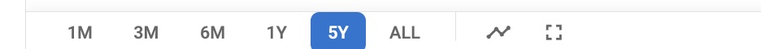

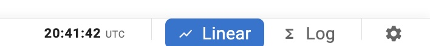

### Day/Week/Month Selection

Candle interval selection on main top bar:

### Interactive Tools

Interactive components of Fibonacci retracements and parallel channels:

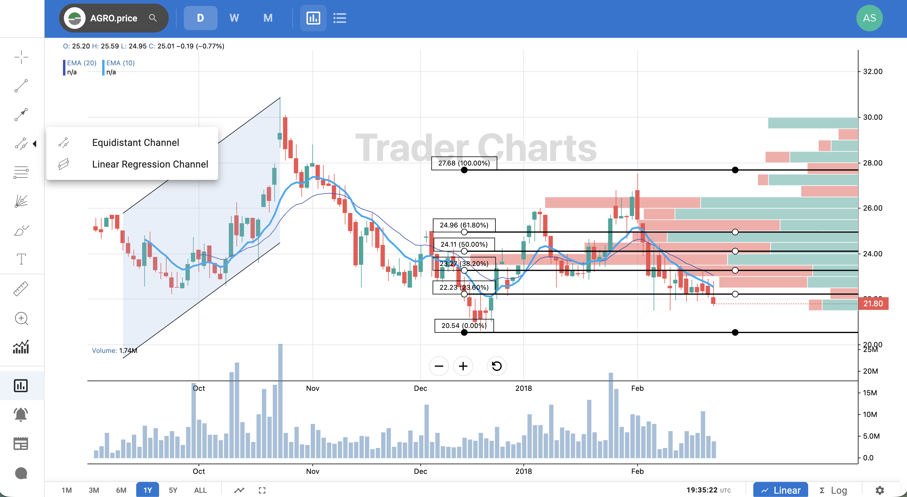

Interactive components of Trend lines, Rays and Extended lines:

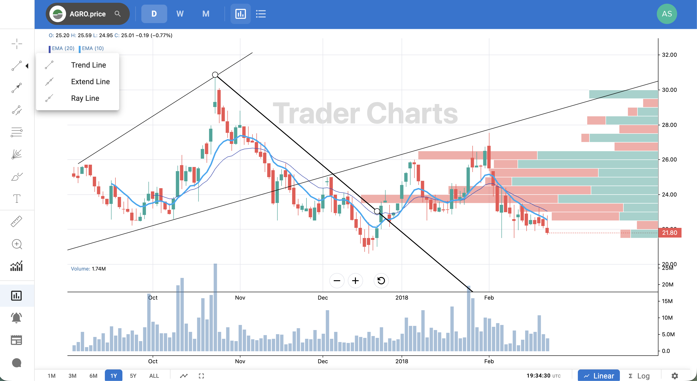

Gann fans interactive component:

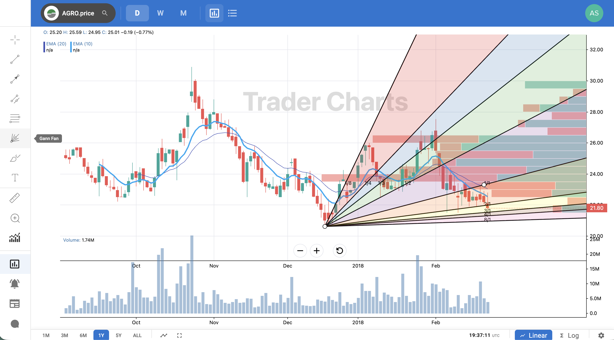

Price Range interactive component:

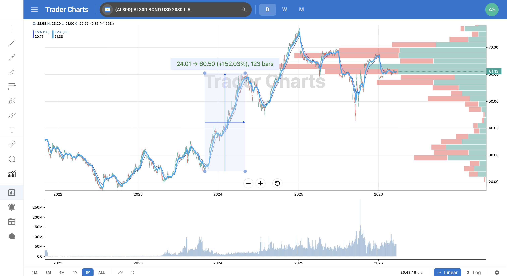

### Search & Indicators

Indicator's details % color picker:

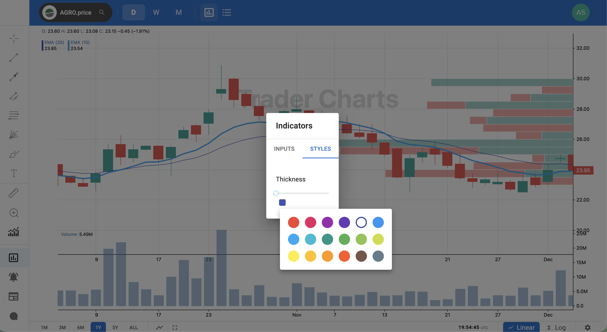

### Watchlists System

Edit Watchlists:

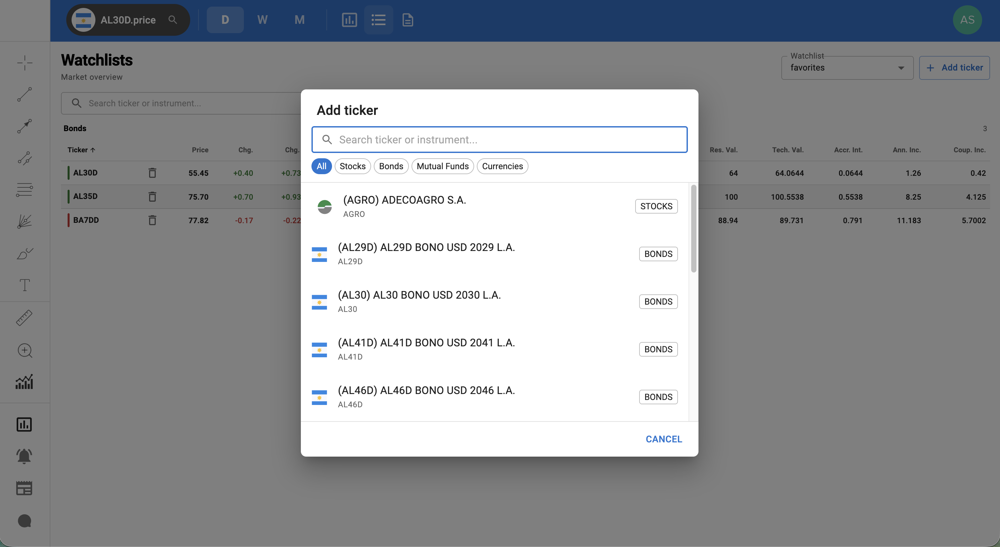

### Instrument Details

- Instrument Documentation

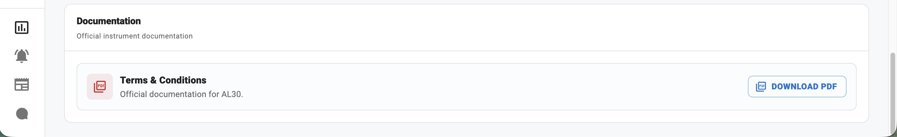

- Bonds Cash Flow Payback

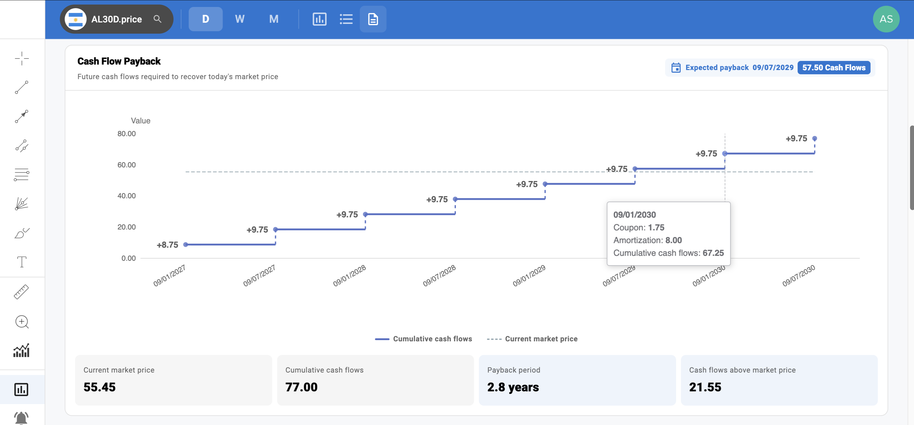

- Bonds Amortization Schedule

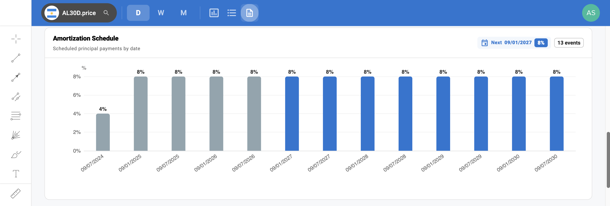

- Bonds Payment Events

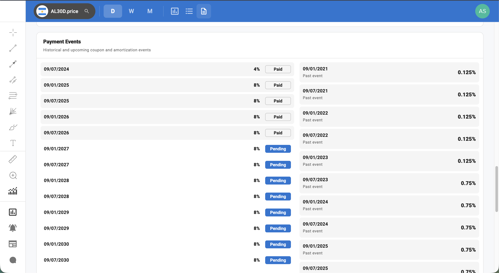

## Contributors ✨

Thanks goes to these wonderful people:

<table>
  <tbody>
    <tr>
      <td align="center" valign="top" width="14.28%"><a href="https://github.com/sgonzaloc"> <b>Gonzalo Sanchez Cano</b></a></td>
    </tr>
  </tbody>
</table>
