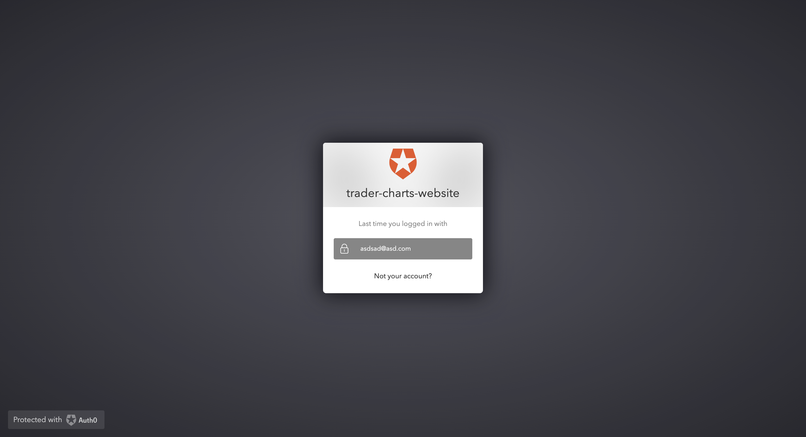
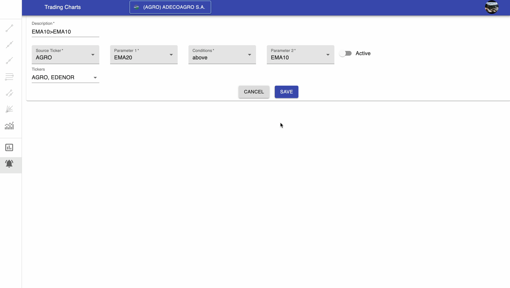

    
    <h1>
       Trader Charts
    </h1>
    <h3>
        Trader Charts is a tool for performing technical analysis with interactive charts. It allows users to visualize stock data or other asset data depending on what the data providers supply, and to apply technical indicators to analyze price trends 
    </h3>
   <h5>
      * One charting tool to rule them all *
   </h5>

---

🚀 **Want to contribute?**

We welcome collaborators who wish to contribute and help enhance this trading tool. Feel free to reach out to the maintainers to get involved.

---

### Trading Charts demo

* [Demo Video](https://drive.google.com/file/d/1P6rXxtZItBR0-MQnIe-N1WODwIFOgjrf/view?usp=drive_link)

   <video width="320" height="240" controls autoplay>
     <source src="https://drive.google.com/file/d/1P6rXxtZItBR0-MQnIe-N1WODwIFOgjrf/view?usp=drive_link" type="video/mp4">
   </video>

### Captures

* Auth0 email login:

* Auth0 Facebook login:

* Charts section:

* Alerts section:

* Alerts editable details:

* Profile Menu:

* Tickers search box:

* Interactive components of Fibonacci retracements and parallel channels:

* Interactive components of Trend lines:

* Interactive components of Rays and Extended lines:

* Gann fans interactive component:

* Gann fans interactive component:

* Indicator's search box:

* Indicator's details:

* Indicator's color picker:

