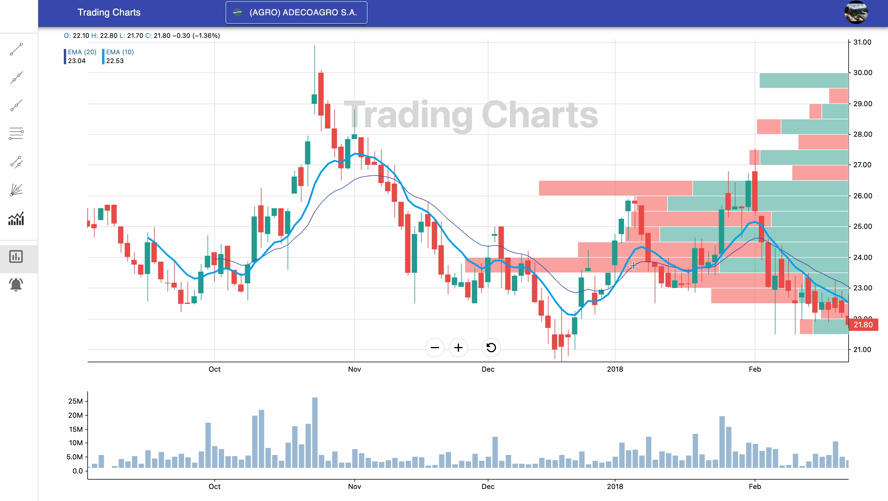

    
    <h1>Trader Charts</h1>
    <h3>Trader Charts is a tool for performing technical analysis with interactive charts. It allows users to visualize stock data or other asset data and apply technical indicators to analyze price trends.</h3>
    <h5>*One charting tool to rule them all*</h5>
     
    <!-- Frontend Badges -->
    

      <!-- Interactive Web Interface (Frontend) -->
      

        <b>Interactive Web Interface (Frontend)</b> 
        
        
        
        
        
        
        
        
        
      

      <!-- React Financial Charts - Exclusive version (Frontend) -->
      

        <b>React Financial Charts - Exclusive version (Frontend)</b> 
        
        
        
        
        
        
        
      

      <!-- Kairos AI -->
      

        <b>Kairos AI (Frontend)</b> 
        
        
        
        
        
        
        
        
        
      

      <!-- Backend -->
      
<b>API Multi-Microservices Architecture (Backend)</b> 
        
        
        
        
        
        
        
        
        
        
        
        
        
        
        
        
        
        
        
      

      <!-- Compute Services -->
      

        <b>LLM-powered AI & Data Automation Services (Compute Services)</b> 
        
        
        
        
        
        
        
        
        
        
        
        
      

    

---

🚀 **Want to contribute?**

We welcome collaborators who wish to contribute and help enhance this trading tool. Feel free to reach out to the maintainers to get involved.

---

## Trader Charts - Overview

This ecosystem brings together three specialized subprojects, each focusing on a key aspect of the trading workflow.  
From automated data collection and processing, through scalable backend services, to interactive visual analytics for end users,  
**_Trader Charts_** delivers a complete solution for technical analysis, market data visualization, and financial decision-making.

### 1️⃣ Interactive Web Interface & React Financial Charts Exclusive version & Kairos AI (Frontend)

- Provides interactive charts and tools for performing technical analysis.
- Built with React, MUI, Redux, and D3.js.
- Includes React Financial Charts (Exclusive version) — advanced charting components for financial data visualization.
- Includes Kairos AI — a Svelte-based AI chat and data interface, enhancing user interactions and AI-powered features.
- [See Interactive Web Interface →](https://github.com/TraderCharts/trader-charts-frontend)

### 2️⃣ API Multi-Microservices Architecture (Backend)

- Handles API requests, processes data, and serves chart information to the Interactive Web Interface.
- Built with Node.js, Express, Babel, MongoDB, and PostgreSQL via Sequelize.
- Acts as the main microservice connecting the frontend with databases.
- [See API Multi-Microservices Architecture →](https://github.com/TraderCharts/trader-charts-backend)

### 3️⃣ LLM-powered AI & Data Automation Services (Compute Services)

- Gathers and processes stock or asset data from various providers.
- Cleans, structures, and stores data in MongoDB for use by the backend and Interactive Web Interface.
- Built with Python, Selenium, PyMongo, and Pandas.
- [See LLM-powered AI & Data Automation Services →](https://github.com/TraderCharts/trader-charts-compute-services)

Together, these components provide a full ecosystem for technical analysis and data visualization.

---

### 4️⃣ Orchestration & Deployment

Trader Charts can be run in both local development and production environments. The system leverages containerization and orchestration platforms to ensure scalability, consistency, and reliable deployment.

**Orchestration Platforms:**

- **Docker Compose** – Simplifies local development by allowing multiple microservices (API, compute services, frontend) to run together with a single command.
- **Kubernetes** – Provides production-grade orchestration, scaling, and management of microservices across multiple nodes.

> 💡 Tip: Step-by-step setup and deployment instructions are available in the internal guides.

**Learn more:**

- [Docker Compose Orchestration Guide](./../docker-compose/README_ORCHESTRATION_COMPOSE.md)
- [Kubernetes Orchestration Guide](./../k8s/README_ORCHESTRATION_K8S.md)

---

### Trading Charts demo

- [Demo Video](https://drive.google.com/file/d/12vBuQgQfU6vP4CiAQe6WRfc9711vaEyW/view?usp=sharing)

   <video width="320" height="240" controls autoplay>
     <source src="https://drive.google.com/file/d/12vBuQgQfU6vP4CiAQe6WRfc9711vaEyW/view?usp=sharing" type="video/mov">
   </video>

### Captures

- Auth0 email login:

- Charts section:

- Alerts section:

- Trending news and topic extraction with AI:

- Trending news and sentimental analysis with AI:

- Kairos AI Chat. Ask anything!

- Interactive components of Fibonacci retracements and parallel channels:

- Interactive components of Trend lines:

- Interactive components of Rays and Extended lines:

- Gann fans interactive component:

- Tickers search box:

- Indicator's search box:

- Indicator's details:

- Indicator's color picker:

- Alerts editable details:

- Profile Menu:

## Contributors ✨

Thanks goes to these wonderful people:

<table>
  <tbody>
    <tr>
      <td align="center" valign="top" width="14.28%"><a href="https://github.com/sgonzaloc"> <b>Gonzalo Sanchez Cano</b></a></td>
    </tr>
  </tbody>
</table>
